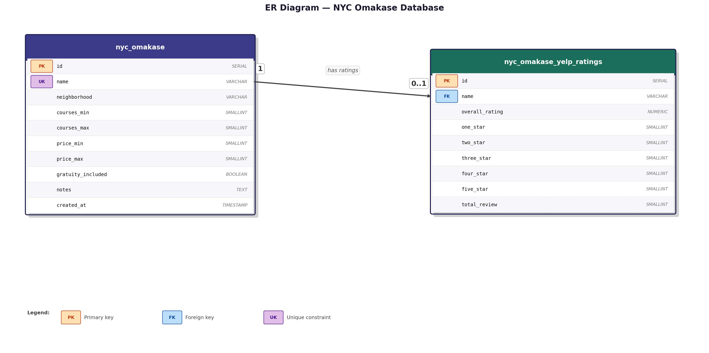
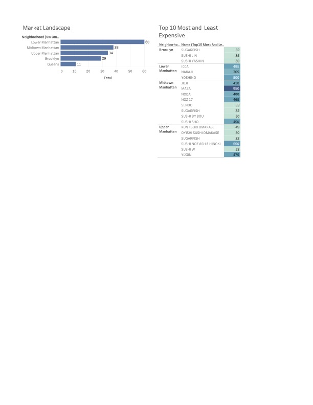

# 🍣 NYC Omakase Market Analysis
## Piggy Horsi: Unstable Omakase — SQL Portfolio Project

---

## 📋 Table of Contents

- [📌 Executive Summary](#-executive-summary)
- [📖 Project Description](#-project-description)
- [🛠️ Tech Stack](#️-tech-stack)
- [🗄️ Data Model](#️-data-model)
- [📂 Data Collection & Preparation](#-data-collection--preparation)
- [❓ Key Business Questions & SQL Analysis](#-key-business-questions--sql-analysis)
  - [🏙️ Market Landscape](#️-market-landscape)
  - [💰 Pricing Strategy](#-pricing-strategy)
  - [⭐ Customer Sentiment](#-customer-sentiment)
  - [💡 Value Analysis](#-value-analysis)
  - [🔍 Opportunity & Competitive Positioning](#-opportunity--competitive-positioning)
- [📊 Visualizations](#-visualizations)
- [💡 Key Insights & Recommendations](#-key-insights--recommendations)
- [⚠️ Limitations](#️-limitations)
- [🚀 Future Improvements](#-future-improvements)
- [▶️ How to Run](#️-how-to-run)
- [🗂️ Project Structure](#️-project-structure)
- [👤 Author](#-author)

---

## 📌 Executive Summary

This project analyzes 172 omakase restaurants across NYC to identify 
the optimal location and pricing strategy for launching **Piggy Horsi: 
Unstable Omakase**. Key findings reveal that Lower Manhattan has the 
highest concentration of restaurants (73), while Brooklyn offers the 
best value at an average of $X per course. Mid-range pricing ($150–$299) 
correlates with the highest Yelp ratings.

---

## 📖 Project Description

New York City has seen a surge in high-end omakase experiences, but the market remains unevenly distributed. This project analyzes:

- Market saturation across neighborhoods
- Pricing trends and their relationship to ratings
- Customer demand using review data
- Strategic gaps for potential new entrants

**Key Objective:** Identify the best location and pricing strategy for launching a successful omakase restaurant.

---

## 🛠️ Tech Stack

| Tool | Purpose |
|---|---|
| PostgreSQL | SQL Analysis |
| DBeaver | Database Management |
| Tableau / Power BI | Data Visualization |
| The Sushi Legend, Yelp, Google Maps | Data Sources |

---

## ER Diagram



## 🗄️ Data Model
| Table | Rows | Description |
|---|---|---|
| nyc_omakase | 172 | Restaurant list from The Sushi Legend |
| nyc_omakase_yelp_ratings | 165 | Yelp ratings and review breakdown |

**Relationship:** One-to-one via `name` (FK → UK)
---

## 📂 Data Collection & Preparation

### Data Sources
- [The Sushi Legend](https://thesushilegend.com/nyc-omakase-list-2026/)
- [Yelp Open Dataset](https://business.yelp.com/data/resources/open-dataset/)
- [Yelp](https://www.yelp.com/) 

### Data Preparation

**1. The Sushi Legend**
- Downloaded the NYC omakase list PDF from [thesushilegend.com](https://thesushilegend.com/nyc-omakase-list-2026/)
- Extracted structured data from the PDF using AI-assisted tools and converted it into a `.csv` format
- Imported the CSV data into PostgreSQL for analysis

**2. Yelp Open Dataset**
- Downloaded the [Yelp Open Dataset](https://business.yelp.com/data/resources/open-dataset/)
- Used Pandas to convert `business.json` and `review.json` to `.csv` files
- Imported Rating data from CSV to PostgresSQL

```python
import pandas as pd
import json

data = []
with open('yelp_academic_dataset_review.json', 'r', encoding='utf-8') as f:
    for line in f:
        data.append(json.loads(line))

df = pd.DataFrame(data)
df.to_csv('review.csv', index=False)
```

- Imported the CSV data into PostgreSQL

**3. Yelp**
- Data from Yelp.com was used to gather information not available in the Yelp Open Dataset.

### Data Cleaning Steps
- Removed duplicates
- Made "name" column unique
- Handled missing/null values

---

## ❓ Key Business Questions & SQL Analysis

### 🏙️ Market Landscape

**Which neighborhood has the most omakase restaurants?**

```sql
SELECT neighborhood, COUNT(*) AS total
FROM public.nyc_omakase
GROUP BY neighborhood
ORDER BY total DESC;
```

| neighborhood | total |
|---|---|
| Lower Manhattan | 73 |
| Midtown Manhattan | 32 |
| Upper Manhattan | 32 |
| Brooklyn | 29 |
| Queens | 11 |

**What is the most common price range across all restaurants?**

```sql
SELECT
    CASE
        WHEN (price_min + price_max) / 2.0 < 75  THEN 'Budget (under $75)'
        WHEN (price_min + price_max) / 2.0 < 150 THEN 'Mid-range ($75–$149)'
        WHEN (price_min + price_max) / 2.0 < 300 THEN 'Premium ($150–$299)'
        ELSE 'Luxury ($300+)'
    END AS price_tier,
    COUNT(*) AS total
FROM public.nyc_omakase
WHERE price_min IS NOT NULL
GROUP BY price_tier
ORDER BY total DESC;
```


### 💰 Pricing Strategy  

**What is the average omakase price?**

```sql
SELECT 
    ROUND(AVG((price_min + price_max) / 2.0), 2) AS avg_price
FROM public.nyc_omakase
WHERE price_min IS NOT NULL
  AND price_max IS NOT NULL;
```

**Top 10 most expensive and cheapest omakase by neighborhood**

```sql
(SELECT 'Most Expensive' AS category, name, neighborhood, price_max AS price
FROM public.nyc_omakase
WHERE price_max IS NOT NULL
ORDER BY price_max DESC
LIMIT 10)
UNION ALL
(SELECT 'Cheapest' AS category, name, neighborhood, price_min AS price
FROM public.nyc_omakase
WHERE price_min IS NOT NULL
ORDER BY price_min ASC
LIMIT 10);
```

**What is the average price per neighborhood?**

```sql
SELECT
    neighborhood,
    ROUND(AVG((price_min + price_max) / 2.0), 2) AS avg_price
FROM public.nyc_omakase
WHERE price_min IS NOT NULL AND price_max IS NOT NULL
GROUP BY neighborhood
ORDER BY avg_price DESC;
```

### ⭐ Customer Sentiment

**Which are the top 10 highest rated omakase on Yelp?**

```sql
SELECT
    o.name,
    o.neighborhood,
    r.overall_rating,
    r.total_review
FROM public.nyc_omakase o
JOIN public.nyc_omakase_yelp_ratings r ON o.name = r.name
WHERE r.overall_rating > 0 AND r.total_review >= 20 
ORDER BY r.overall_rating DESC, r.total_review DESC
LIMIT 10;
```

**What is the price per course for each restaurant (cost efficiency)?**

```sql
SELECT
    name,
    neighborhood,
    ROUND((price_min + price_max) / 2.0, 2) AS avg_price,
    ROUND((courses_min + courses_max) / 2.0, 1) AS avg_courses,
    ROUND(((price_min + price_max) / 2.0) / ((courses_min + courses_max) / 2.0), 2) AS price_per_course
FROM public.nyc_omakase
WHERE price_min IS NOT NULL AND courses_min IS NOT NULL
ORDER BY price_per_course ASC;
```

**What percentage of reviews are 5-star per restaurant?**

```sql
SELECT
    name,
    overall_rating,
    total_review,
    five_star,
    ROUND(five_star * 100.0 / NULLIF(total_review, 0), 1) AS pct_five_star
FROM public.nyc_omakase_yelp_ratings
WHERE total_review > 0
ORDER BY pct_five_star DESC
LIMIT 15;
```

**Which restaurants have the most polarizing reviews (high 1-star AND 5-star counts)?**

```sql
SELECT
    name,
    overall_rating,
    one_star,
    five_star,
    total_review,
    ROUND((one_star + five_star) * 100.0 / NULLIF(total_review, 0), 1) AS polarization_pct
FROM public.nyc_omakase_yelp_ratings
WHERE total_review > 20
ORDER BY polarization_pct DESC
LIMIT 10;
```


**Which restaurants include gratuity and how do they compare in price and rating?**

```sql
SELECT
    o.gratuity_included,
    COUNT(*) AS total,
    ROUND(AVG((o.price_min + o.price_max) / 2.0), 2) AS avg_price,
    ROUND(AVG(r.overall_rating), 2) AS avg_rating
FROM public.nyc_omakase o
LEFT JOIN public.nyc_omakase_yelp_ratings r ON o.name = r.name
WHERE o.price_min IS NOT NULL AND r.overall_rating > 0
GROUP BY o.gratuity_included;
```

**Which restaurants have the most Yelp reviews (most popular)?**

```sql
SELECT
    o.name,
    o.neighborhood,
    ROUND((o.price_min + o.price_max) / 2.0, 2) AS avg_price,
    r.overall_rating,
    r.total_review
FROM public.nyc_omakase o
JOIN public.nyc_omakase_yelp_ratings r ON o.name = r.name
WHERE r.total_review > 0
ORDER BY r.total_review DESC
LIMIT 10;
```

### 💡 Value Analysis

**Which neighborhood has the best average Yelp rating?**

```sql
SELECT
    o.neighborhood,
    ROUND(AVG(r.overall_rating), 2) AS avg_rating,
    COUNT(*) AS total_rated
FROM public.nyc_omakase o
JOIN public.nyc_omakase_yelp_ratings r ON o.name = r.name
WHERE r.overall_rating > 0
GROUP BY o.neighborhood
ORDER BY avg_rating DESC;
```

**Which restaurant offers the best value (highest rating per dollar)?**

```sql
SELECT
    o.name,
    o.neighborhood,
    ROUND((o.price_min + o.price_max) / 2.0, 2) AS avg_price,
    r.overall_rating,
    ROUND(r.overall_rating / ((o.price_min + o.price_max) / 2.0) * 100, 4) AS rating_per_dollar
FROM public.nyc_omakase o
JOIN public.nyc_omakase_yelp_ratings r ON o.name = r.name
WHERE o.price_min IS NOT NULL AND r.overall_rating > 0
ORDER BY rating_per_dollar DESC
LIMIT 10;
```

**Which neighborhood has the best value (most courses per dollar)?**

```sql
SELECT
    neighborhood,
    ROUND(AVG((courses_min + courses_max) / 2.0), 1) AS avg_courses,
    ROUND(AVG((price_min + price_max) / 2.0), 2) AS avg_price,
    ROUND(AVG((courses_min + courses_max) / 2.0) / AVG((price_min + price_max) / 2.0), 4)  AS courses_per_dollar
FROM public.nyc_omakase
WHERE price_min IS NOT NULL AND courses_min IS NOT NULL
GROUP BY neighborhood
ORDER BY courses_per_dollar DESC;
```

**Does price correlate with Yelp rating?**

```sql
SELECT
    o.name,
    o.neighborhood,
    ROUND((o.price_min + o.price_max) / 2.0, 2) AS avg_price,
    r.overall_rating
FROM public.nyc_omakase o
JOIN public.nyc_omakase_yelp_ratings r ON o.name = r.name
WHERE o.price_min IS NOT NULL AND r.overall_rating > 0
ORDER BY avg_price DESC;
```

### 🔍 Opportunity & Competitive Positioning

**What is the cheapest highly rated omakase (rating ≥ 4.5, price under $150)?**

```sql
SELECT
    o.name,
    o.neighborhood,
    ROUND((o.price_min + o.price_max) / 2.0, 2) AS avg_price,
    r.overall_rating,
    r.total_review
FROM public.nyc_omakase o
JOIN public.nyc_omakase_yelp_ratings r ON o.name = r.name
WHERE r.overall_rating >= 4.5
  AND (o.price_min + o.price_max) / 2.0 < 150
  AND r.total_review > 10
ORDER BY avg_price ASC;
```

**Hidden gems — highly rated but low review count (underrated spots)?**

```sql
SELECT
    o.name,
    o.neighborhood,
    ROUND((o.price_min + o.price_max) / 2.0, 2) AS avg_price,
    r.overall_rating,
    r.total_review
FROM public.nyc_omakase o
JOIN public.nyc_omakase_yelp_ratings r ON o.name = r.name
WHERE r.overall_rating >= 4.7
  AND r.total_review BETWEEN 5 AND 50
ORDER BY r.overall_rating DESC, r.total_review ASC;
```

---

## 📊 Visualizations

### 📊 Dashboard



---

### Insights
- High-density areas (e.g., Manhattan) show strong competition
- Emerging neighborhoods may offer better entry opportunities
- Price and rating show diminishing returns beyond a threshold

---

## 💡 Key Insights & Recommendations

- **Best Locations:** Neighborhoods with high review counts but fewer competitors
- **Optimal Pricing:** Mid-to-high tier pricing performs best
- **Market Gap:** Opportunity for premium experiences outside saturated areas

---

## ⚠️ Limitations

- Review data may be biased or incomplete
- Pricing may not reflect current market conditions
- Some neighborhood mappings required manual cleaning

---

## 🚀 Future Improvements

- Time-series analysis of omakase market growth
- Sentiment analysis on customer reviews
- Integration with demographic and income data
- Predictive modeling for restaurant success

---

## ▶️ How to Run
1. Clone this repository
2. Set up PostgreSQL and create the database
3. Run `sql/01_create_tables.sql` to create the schema
4. Import `data/nyc_omakase_2026.csv` into `nyc_omakase`
5. Import `data/nyc_omakase_yelp_ratings.csv` into `nyc_omakase_yelp_ratings`
6. Run `sql/02_analysis.sql` for all analysis queries
7. Open Tableau/Power BI and connect to the database for visualizations

---

## 🗂️ Project Structure
/data
  ├── nyc_omakase_2026.csv
  └── nyc_omakase_yelp_ratings.csv
/sql
  ├── 01_create_tables.sql
  ├── 02_load_data.sql
  └── 03_analysis.sql
/images
  ├── er_diagram.jpg
  └── dashboard.jpg
README.md

---

## 👤 Author

**Amanda Low**
- **LinkedIn:** 
